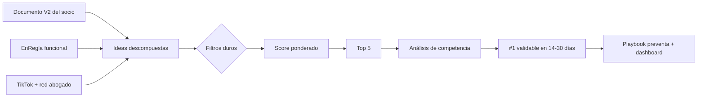

# Evaluation Process Ecuador v2.0

> **Estado:** documento maestro · v2.0 · 2026-06-15  
> **Propósito:** convertir visión estratégica, activos existentes y canal propio en un ranking accionable de ideas para lograr el primer ingreso en menos de 90 días.  
> **Equipo clave:** Danilo — ingeniería/producto, part-time 10–15h/sem — + socio abogado — legal/ventas, abogado colegiado, red profesional y TikTok legal ~25k seguidores.  
> **Activo crítico:** EnRegla, SaaS de compliance/permisos funcional, sin deploy productivo.  
> **Documento base:** `criterios-base-ecuador-v2.0.md`.

---

## Resumen ejecutivo

Aura Ecuador no debe empezar construyendo una plataforma completa. Debe empezar vendiendo una oferta pequeña, clara, cobrable y recurrente.

La filosofía de v2.0 es:

> **Vender rápido, retener siempre y usar el superpoder TikTok.**

El sistema toma tres fuentes:

1. la visión estratégica/documento V2 del socio abogado;
2. EnRegla como activo funcional;
3. los servicios legales/comerciales que el abogado ya puede vender;

y las convierte en un ranking con filtros duros, criterios ponderados, análisis competitivo y una recomendación accionable.

---

## Flujo general



---

## Las cinco capas del sistema

| Capa | Contenido | Archivo / sección |
|---|---|---|
| 1. Motor estratégico | Objetivo, contexto Ecuador, ventajas del equipo | `criterios-base-ecuador-v2.0.md` §0–3 |
| 2. Criterios ponderados | 11 criterios con pesos ajustados | `criterios-base-ecuador-v2.0.md` §4–5 |
| 3. Filtros de descarte | 7 reglas binarias + notas críticas | `criterios-base-ecuador-v2.0.md` §6–7 |
| 4. Análisis de competencia | Obligatorio para top 5 | `criterios-base-ecuador-v2.0.md` §8 |
| 5. Gobierno y salida | Dashboard, playbook y ranking final | Este documento §8–11 |

---

## 1. Objetivo dominante

Priorizar ideas que logren:

| Objetivo | Umbral |
|---|---:|
| Primer ingreso | ≤90 días |
| Primera oferta vendible | ≤60 días |
| Validación inicial | 14–30 días |
| Recurrencia deseada | ≥40% de clientes convertibles a MRR/retainer |
| CAC inicial objetivo | ≤$20 por lead calificado desde TikTok/red |
| Capital antes de validar | ≤$10.000 |

La evaluación favorece ofertas que puedan cobrar primero y sofisticarse después.

---

## 2. Fuentes de ideas

### 2.1 Documento V2 del socio abogado

Contiene la visión grande: LOPDP, UAFE, permisos, gobierno corporativo, gestión documental, contratos, automatización y capas futuras.

**Uso correcto:** descomponer la visión en ofertas vendibles, no construir todo de entrada.

---

### 2.2 EnRegla

Activo funcional que puede servir como:

- demo;
- sistema interno de seguimiento;
- SaaS directo;
- componente de retainer;
- white-label para estudios/contadores;
- base para dashboards, alertas y recordatorios.

---

### 2.3 Servicios del abogado + TikTok/red

Servicios que el socio puede explicar, vender y entregar hoy:

- diagnósticos;
- auditorías;
- revisiones;
- implementación básica;
- capacitaciones;
- paquetes sectoriales;
- acompañamiento mensual.

TikTok y la red profesional funcionan como motor inicial de demanda.

---

## 3. Agrupación de ideas

| Grupo | Tipo | Función |
|---|---|---|
| A | Servicio vendible en <60 días | Cashflow inmediato |
| B | Híbrido servicio + producto | Validar vendiendo y alimentar EnRegla |
| C | Producto/SaaS | Recurrencia y margen |
| D | White-label / B2B2B | Escala vía estudios, contadores o aliados |
| E | Plataforma ambiciosa | Visión futura; activar después del cashflow |

---

## 4. Criterios ponderados v2.0

Cada idea se puntúa de 1 a 10 en cada criterio. El score ponderado se calcula multiplicando cada nota por su peso.

| # | Criterio | Peso |
|---:|---|---:|
| 1 | Potencial de ingreso rápido | 14% |
| 2 | Urgencia del cliente | 12% |
| 3 | Recurrencia / MRR | 12% |
| 4 | Encaje TikTok + red | 10% |
| 5 | Velocidad de venta inicial | 10% |
| 6 | Validación operativa del equipo | 8% |
| 7 | Margen + apalancamiento | 8% |
| 8 | Facilidad de MVP / preventa | 8% |
| 9 | Sinergia cross-idea | 6% |
| 10 | Riesgo controlado | 6% |
| 11 | Expansión | 6% |

**Total:** 100%.

---

## 5. Filtros de descarte

Una idea queda fuera de la fase inicial si falla cualquiera de estos filtros:

| Filtro | Pregunta |
|---|---|
| F1. Comprador identificable | ¿Quién paga y de qué presupuesto? |
| F2. Primera venta ≤60 días | ¿Existe oferta vendible/preventa rápida? |
| F3. CAC no depende de pauta masiva | ¿Puede venderse con TikTok/red/outbound dirigido? |
| F4. No es margen artesanal | ¿Puede productizarse o apalancarse? |
| F5. Capital inicial ≤$10.000 | ¿Se valida sin quemar capital excesivo? |
| F6. Danilo no es >70% continuo | ¿La operación no depende permanentemente de Danilo? |
| F7. Prospectos alcanzables | ¿Hay lista nominal o segmento TikTok medible? |

### Nota sobre F6

La dependencia de Danilo se mide como esfuerzo operativo continuo, no como pico técnico puntual.  
Un sprint corto para montar landing, demo, dashboard o automatización puede ser aceptable si luego la entrega queda operable por el abogado, EnRegla o procesos repetibles.

---

## 6. Notas críticas antes del top 5

Antes de aceptar una idea en el top 5, revisar cuatro riesgos:

### 6.1 Dolor separado del pagador

Quien sufre el problema debe poder convencer a quien paga.  
Si no, la idea necesita una narrativa para el dueño/gerente: multa, clausura, pérdida de contrato, riesgo reputacional o ahorro operativo.

### 6.2 Claridad de oferta

La idea debe poder expresarse así:

> “Por $X revisamos si tu negocio cumple con Y, te entregamos Z en N días, y por $W/mes te mantenemos al día.”

Si no cabe en una frase, no está lista para vender.

### 6.3 Calidad de cliente y cobranza

Priorizar clientes formales, con capacidad de anticipo, urgencia real y bajo riesgo de soporte/regateo infinito.

### 6.4 Soporte infinito

Si cada cliente exige rediseñar todo desde cero, la idea no es producto ni servicio productizado. Debe producir activos reusables.

---

## 7. Proceso de evaluación paso a paso

### Paso 1 · Describir la idea en una frase

Formato:

> “Ayudamos a [cliente] a resolver [dolor] mediante [oferta] para lograr [resultado] en [tiempo].”

---

### Paso 2 · Identificar comprador, presupuesto y urgencia

Responder:

- ¿quién firma?
- ¿quién influye?
- ¿de qué presupuesto sale?
- ¿qué pasa si no compra?
- ¿por qué ahora?

---

### Paso 3 · Definir primera oferta vendible

Debe incluir:

- nombre de la oferta;
- precio inicial;
- anticipo o forma de cobro;
- entregable visible;
- plazo de entrega;
- camino a retainer/MRR.

---

### Paso 4 · Aplicar filtros duros

Si falla un filtro, la idea se pausa para la fase inicial.

---

### Paso 5 · Puntuar criterios ponderados

Cada criterio se puntúa de 1 a 10.  
El score se calcula así:

```text
score = Σ(nota_criterio × peso_criterio)
```

Ejemplo: si la nota está en escala 1–10 y el peso está en porcentaje, el resultado final se mantiene en escala 1–10.

---

### Paso 6 · Análisis de competencia para top 5

Para cada idea candidata al top 5:

1. competidores directos;
2. competidores indirectos;
3. alternativa interna del cliente;
4. posición de Aura frente a cada uno;
5. defensibilidad concreta;
6. riesgo competitivo y mitigación.

---

### Paso 7 · Ranking final

Ordenar por:

1. pasa/falla filtros;
2. score ponderado;
3. evidencia real de leads o conversaciones;
4. facilidad de cobrar anticipo;
5. capacidad de conversión a recurrencia.

---

## 8. Análisis de competencia obligatorio

Cada idea top 5 debe incluir esta estructura:

### 8.1 Competidores directos

| Competidor | Modelo | Ticket estimado | Dónde gana | Dónde pierde |
|---|---|---:|---|---|

---

### 8.2 Competidores indirectos

| Sustituto | Por qué el cliente lo elige | Cómo responder |
|---|---|---|

Ejemplos:
- ChatGPT;
- plantillas gratis;
- contador;
- abogado interno;
- no hacer nada.

---

### 8.3 Defensibilidad Aura

Evaluar si la idea aprovecha:

- EnRegla ya construido;
- TikTok 25k;
- abogado colegiado;
- socio con capacidad comercial y cercanía;
- Danilo como producto/tech;
- metodología;
- data acumulada;
- contenido educativo;
- red inicial.

---

### 8.4 Riesgos competitivos

Responder:

- ¿qué pasa si un estudio grande baja precios?
- ¿qué pasa si un competidor copia el TikTok?
- ¿qué pasa si aparece SaaS local?
- ¿qué pasa si el cliente usa plantillas/ChatGPT?
- ¿cómo se mitiga cada riesgo?

---

## 9. Gobierno simplificado

### 9.1 Revisión semanal — 15 minutos

Dashboard mínimo:

| Métrica | Responsable | Frecuencia |
|---|---|---|
| Videos TikTok publicados | Socio | Semanal |
| CTA usado | Socio + Danilo | Semanal |
| DMs/leads | Socio | Semanal |
| Leads calificados | Ambos | Semanal |
| Reuniones | Socio | Semanal |
| Propuestas enviadas | Ambos | Semanal |
| Preventas firmadas | Ambos | Semanal |
| Ingresos cobrados | Ambos | Semanal |
| Objeciones repetidas | Ambos | Semanal |

---

### 9.2 Re-ranking por evento

Re-rankear solo si existe evidencia:

- primer contrato pagado;
- una idea produce leads superiores;
- objeción mortal;
- cambio regulatorio;
- competidor nuevo;
- falla operativa real;
- margen real distinto al esperado.

---

## 10. Salida del proceso

El entregable final debe ser `ranking-ideas-ecuador-v2.0.md` e incluir:

1. Top 5 ideas con score;
2. filtros aplicados;
3. análisis de competencia;
4. recomendación #1;
5. playbook de preventa;
6. lista/segmento de clientes;
7. pricing inicial;
8. landing/demo mínima;
9. hipótesis de fracaso;
10. señales de pivote;
11. dashboard base de seguimiento;
12. nota táctica sobre cómo usar el estilo del socio sin perder seriedad.

---

## 11. Plantilla para evaluar una idea

```markdown
## Idea: [Nombre]

### 1. Descripción en una frase
Ayudamos a [cliente] a resolver [dolor] mediante [oferta] para lograr [resultado] en [tiempo].

### 2. Comprador
- Comprador:
- Influenciador:
- Usuario:
- Presupuesto:
- Urgencia:

### 3. Primera oferta vendible
- Oferta:
- Precio:
- Anticipo:
- Entregable:
- Plazo:
- Camino a MRR:

### 4. Filtros
| Filtro | Pasa/Falla | Nota |
|---|---|---|
| F1 Comprador identificable |  |  |
| F2 Venta ≤60 días |  |  |
| F3 CAC sin pauta masiva |  |  |
| F4 No artesanal |  |  |
| F5 Capital ≤$10k |  |  |
| F6 Danilo no >70% continuo |  |  |
| F7 Prospectos alcanzables |  |  |

### 5. Score
| Criterio | Peso | Nota | Score |
|---|---:|---:|---:|
| Ingreso rápido | 14% |  |  |
| Urgencia | 12% |  |  |
| Recurrencia/MRR | 12% |  |  |
| TikTok + red | 10% |  |  |
| Velocidad venta | 10% |  |  |
| Validación operativa | 8% |  |  |
| Margen + apalancamiento | 8% |  |  |
| MVP / preventa | 8% |  |  |
| Sinergia cross-idea | 6% |  |  |
| Riesgo controlado | 6% |  |  |
| Expansión | 6% |  |  |

### 6. Competencia
- Directos:
- Indirectos:
- Alternativa interna:
- Dónde gana Aura:
- Dónde pierde Aura:
- Defensibilidad:
- Riesgo competitivo:

### 7. Veredicto
- Score final:
- Decisión:
- Evidencia faltante:
- Próxima prueba:
```

---

## 12. Próximo paso

Ejecutar el proceso con ideas provenientes de:

1. Documento V2 del socio abogado;
2. EnRegla;
3. servicios legales actuales del abogado;
4. formatos vendibles por TikTok/red;
5. posibles white-labels a estudios, contadores o aliados.

El resultado debe ser un ranking v2.0 y una recomendación #1 lista para validar en 14–30 días.
